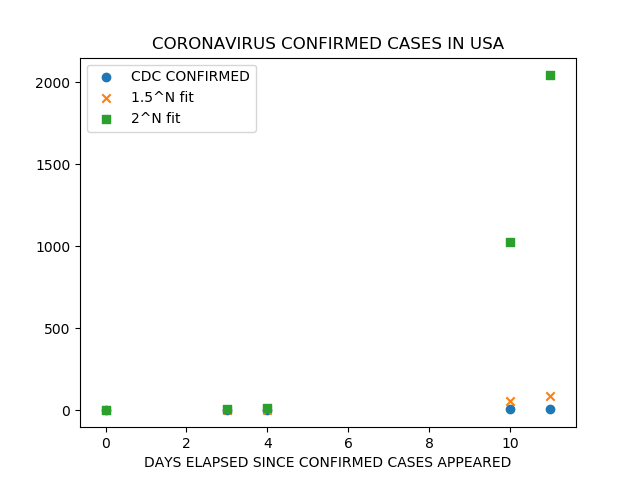

last updated 2020-02-05

[READ THIS](https://www.nytimes.com/interactive/2020/world/asia/china-coronavirus-contain.html)
# ALERTS
**CURRENT CONFIRMED TOTAL US SICK COUNT = 12 (likely 14, tests pending)**

[**Epidemiologist warns lawmakers: US can’t keep coronavirus ‘out of our border’**](https://www.cnbc.com/2020/02/05/coronavirus-live-updates.html)

**2 sick in Bay Area, 6 total in California**

[**airports and hubs lost at sea, scrambling to implement travel restrictions**](https://www.wmur.com/article/airport-officials-scramble-to-meet-the-demands-of-new-coronavirus-travel-rules/30772263#)

[**scientists and health officials know very little about this thing, quote from Harvard University:"we are dealing with a serious and novel pathogen"**](https://www.health.harvard.edu/blog/the-new-coronavirus-what-we-do-and-dont-know-2020012518747)

[**"deaths in China rise with no sign of slowdown", NY Times**](https://www.nytimes.com/2020/02/04/world/asia/coronavirus-china.html?action=click&pgtype=Article&state=default&module=styln-coronavirus-us&variant=show&region=TOP_BANNER&context=storyline_menu)

[**"testing dozens of other possible cases in US, NY Times"**](https://www.nytimes.com/2020/02/03/us/coronavirus-united-states-cases.html)

[**CDC expects sick numbers to grow**](https://www.msn.com/en-us/news/us/as-coronavirus-cases-spread-across-california-cdc-warns-count-will-keep-growing/ar-BBZCl5e)


**"around 25% of those reported to be infected become SEVERELY ill"** source: [NIH doctor](https://www.cnbc.com/2020/02/03/nih-dr-anthony-fauci-25percent-of-china-coronavirus-cases-very-serious.html)

[**first death in Hong Kong, 39-year old man**](https://www.cnbc.com/2020/02/04/coronavirus-latest-updates-china-hubei.html)

**first death out of China**

**mask prices are significantly increasing online, order soon** mask delivery times more than month on some items on amazon, outside USA, reports of complete mask selloff online.
## DISCLAIMER
I'm NOT a medical or healthcare professional. this is NOT medical advice.

USE THE INFORMATION HERE AT YOUR OWN RISK. 100% OF THE LIABILITY IS YOURS.
# Charts

# Links
[CDC official prevention guide](https://www.cdc.gov/coronavirus/2019-ncov/about/prevention-treatment.html)

[good link on masks](https://findme10.com/best-coronavirus-mask/)

[by country and territory breakdown wiki page](https://en.wikipedia.org/wiki/2019%E2%80%9320_Wuhan_coronavirus_outbreak_by_country_and_territory)
# GREEN TIER:
## healthy adults below 40 years old, meaning UN-compromised immune system, generally in good shape
- stay/work from home
- buy food, wash and cook yourself, limit order in or restaurants
- **every time you enter your house**, wash hands with soap for 20 seconds min, hot or cold
- **stay healthy** get plenty of exercise, preferably outside, non-busy places/times (isn’t this great), run, walk, cycle... just don’t touch stuff you don’t have to, stay clear of crowds
- build up your defenses with multivitamin + extra vitamin c
- buy disposable 3M N95 masks, like [**this**](https://multimedia.3m.com/mws/media/218306O/particle-respirator-8000-n95.pdf) or [**this for better fit**](https://www.3m.com/3M/en_US/company-us/all-3m-products/~/3M-Particulate-Respirator-8511-N95-80-EA-Case/?N=5002385+3294780243&rt=rud) and wear them in public places (bus, train, food store, office, indoor gym)
- _bonus trick_ : buy at minimum 20 disposable masks, mark/arrange them with distinct numbers, cycle through them one a day. Example, wear mask number 1 during day 1, mask 2 for day 2, … mask 1 for day 21 and on and on and on….
# YELLOW TIER:
## extra cautious healthy adults below 40 years old, super healthy 40-60 year olds, super healthy meaning UN-compromised immune system, balanced weight, balanced diet, regular exercise
- stay/work from home
- buy food, wash and cook yourself, limit order in or restaurants
- **every time you enter your house**, wash hands with soap for 20 seconds min, hot or cold
- **every time you enter your house** clean (meaning disinfect) your phone, ipad, laptop, keys, whatever else you frequently touched when you were out. use your best judgment, don't go crazy. how to clean your phone? buy strongest Isopropyl Alcohol you can find. make a one part alcohol, one part water mix and put the combined solution into an empty spray bottle (or something similar) and use a little bit together with a kitchen paper towel to clean your phone, keys, laptop... you could also dilute down more by adding water if you are really scared of damaging the finish on your phone.
- **stay healthy** get plenty of exercise, preferably outside, non-busy places/times (isn’t this great), run, walk, cycle... just don’t touch stuff you don’t have to, stay clear of crowds
- build up your defenses with multivitamin + extra vitamin c
- you likely want something better than disposable masks (like those in Green tier), i recommend [**this**](https://www.amazon.com/dp/B00IF7RAP8?tag=findme10usa02-20&linkCode=ogi&th=1&psc=1). but pay attention, _there are different sizes_. Also, if you buy a P100 filter for this, the air flow might be too weak and annoy you. a compromise is probably to go with P95 or any smooth/cool flow filters, they are more bearable which means you are more likely to keep the mask on.
# RED TIER:
## anyone above 60 years old, PARENTS of young children. anyone living with old people or children
coming...

<!--  You can use the [editor on GitHub](https://github.com/mghah/mghah.github.io/edit/master/README.md) to maintain and preview the content for your website in Markdown files.

Whenever you commit to this repository, GitHub Pages will run [Jekyll](https://jekyllrb.com/) to rebuild the pages in your site, from the content in your Markdown files.

Markdown is a lightweight and easy-to-use syntax for styling your writing. It includes conventions for

```markdown
Syntax highlighted code block

# Header 1
## Header 2
### Header 3

- Bulleted
- List

1. Numbered
2. List

**Bold** and _Italic_ and `Code` text

[Link](url) and 
```

For more details see [GitHub Flavored Markdown](https://guides.github.com/features/mastering-markdown/).

### Jekyll Themes

Your Pages site will use the layout and styles from the Jekyll theme you have selected in your [repository settings](https://github.com/mghah/mghah.github.io/settings). The name of this theme is saved in the Jekyll `_config.yml` configuration file.

### Support or Contact

Having trouble with Pages? Check out our [documentation](https://help.github.com/categories/github-pages-basics/) or [contact support](https://github.com/contact) and we’ll help you sort it out. -->
